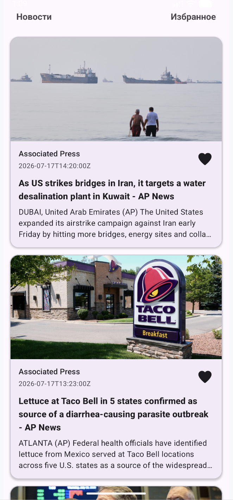
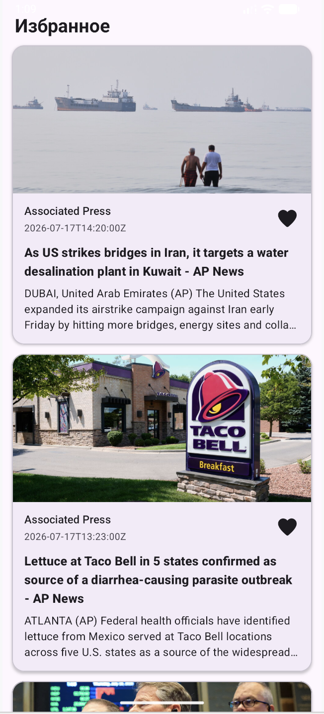

# NewsApp

NewsApp is an Android application for browsing news articles, saving favorite articles, and opening
the original news source.

The application uses a remote News API together with local Room storage and follows an MVVM-based
architecture.

## Screenshots

<p align="center">



</p>

## Features

- Loading news from a remote API
- Displaying a news feed
- Detailed article screen
- Opening the original article in a browser
- Adding and removing articles from favorites
- Separate favorites screen
- Local data storage with Room
- Network error handling
- Loading state handling
- Reactive UI updates with Flow and StateFlow

## Tech Stack

- Kotlin
- Android SDK
- XML
- ViewBinding
- MVVM
- Kotlin Coroutines
- Flow / StateFlow
- Retrofit
- Gson
- OkHttp
- Room
- Coil
- RecyclerView / ListAdapter / DiffUtil
- Navigation Component

## Architecture

The application is separated into several layers:

```text
UI
│
├── Fragment
├── RecyclerView / Adapter
│
▼
ViewModel
│
▼
Repository
│
├── Retrofit → Remote API
│
└── Room → Local Database
```

The project uses separate models for different application layers:

```text
DTO
↓
Mapper
↓
Entity
↓
Room
↓
Mapper
↓
Domain Model
↓
ViewModel
↓
UI
```

Room acts as the local source of data, while Retrofit is responsible for retrieving fresh news from
the remote API.

## Data Flow

When news is refreshed:

```text
News API
↓
Retrofit
↓
DTO
↓
Mapper
↓
Room Database
↓
Flow
↓
Repository
↓
ViewModel
↓
StateFlow
↓
Fragment
↓
RecyclerView
```

Changes in the Room database are observed through `Flow`, allowing the UI to react automatically
when the stored data changes.

## Favorites

Favorite state is stored locally in Room.

When the user changes the favorite state:

```text
RecyclerView
↓
Click Listener
↓
Fragment
↓
ViewModel
↓
Repository
↓
DAO
↓
Room
↓
Flow
↓
UI update
```

## Network State

The application handles different request states:

- Loading
- Successful response
- Network error
- Empty data

The ViewModel exposes the current UI state through `StateFlow`.

## API

The application uses NewsAPI for retrieving news.

The API key is not stored directly in the source code.

Create a `NEWS_API_KEY` property inside your local `local.properties` file:

```properties
NEWS_API_KEY=your_api_key
```

The value is provided to the application through `BuildConfig`.

`local.properties` is excluded from Git and must not be committed to the repository.

## Project Structure

```text
ru.app.newsapp
│
├── adapter
│
├── data
│   ├── local
│   │   ├── dao
│   │   ├── entity
│   │   └── appDb
│   │
│   ├── mapper
│   │
│   ├── remote
│   │   ├── apiProvider
│   │   ├── apiService
│   │   └── dto
│   │
│   └── repositoryImpl
│
├── domain
│   ├── model
│   └── repository
│
├── fragment
│
├── ui
│
├── utils
│
└── viewModel
```

## Getting Started

1. Clone the repository.
2. Open the project in Android Studio.
3. Get an API key from NewsAPI.
4. Add the API key to `local.properties`:

```properties
NEWS_API_KEY=your_api_key
```

5. Sync the project with Gradle.
6. Run the application.

## What I Practiced

This project was created to practice and consolidate:

- Working with REST APIs using Retrofit
- JSON response mapping with DTO models
- Local persistence with Room
- Repository pattern
- MVVM architecture
- Kotlin Coroutines
- Flow and StateFlow
- Reactive UI state management
- RecyclerView and DiffUtil
- Android Navigation Component
- Working with external intents
- Error and loading state handling
- Separating remote, local, domain and UI layers